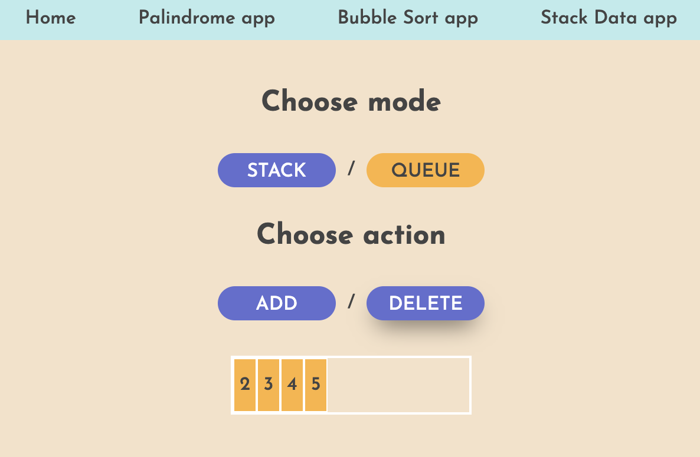

# Databases and Data Structures course

Databases and Data Structures course at Business college Helsinki. My solution to course tasks: a palindrome checker app, a bubble sort app, a stack data structure app.
Initially these tasks were done in this repository - [link](https://github.com/KozhInna/databases_tasks_23S)

### Technologies Used

ReactJS, HTML, CSS

### **Check it out!**

[App](https://euphonious-crepe-a8e927.netlify.app)
